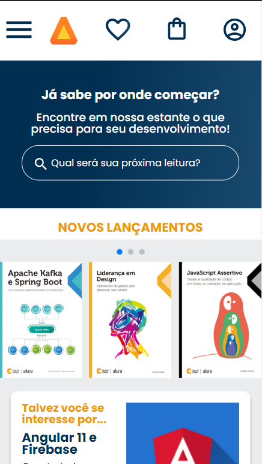
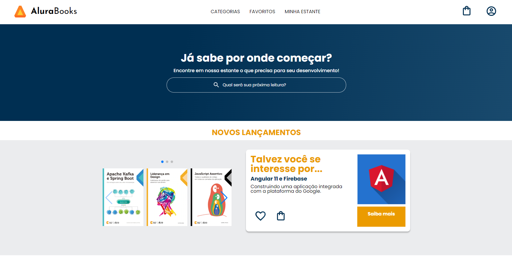

# Alura-Livros

Projeto feito durante o curso responsividade com mobile-first da Alura, utilizando somente HTML e CSS.

Minha Página ficou assim: 

  <h2> Página para dispositivos móveis </h2>

   <h2> Página 1024px </h2>

   <h2> Página 1728x </h2>

    <h2> Tópicos e rodapé </h2>

